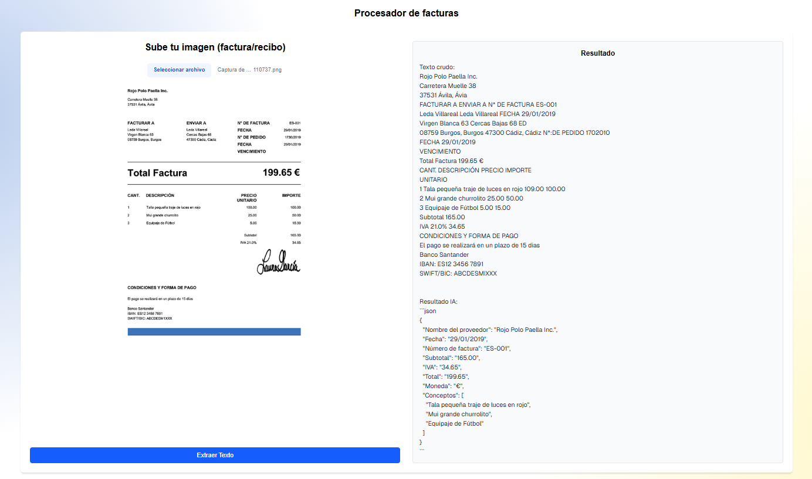

# 🧾 OCR Facturación AI

Aplicación web que permite subir imágenes de facturas o recibos, extraer su texto con OCR y usar IA para obtener datos clave como **fecha** e **importe total**.

 <!-- Cambia la ruta si usas otra imagen -->

## 🚀 Demo

🔗 [Ver demo en Vercel](https://facturacion-ia.vercel.app/)

> Requiere iniciar sesión (Clerk).

## 🔐 Autenticación con Clerk

- Se utiliza Clerk para gestionar usuarios.
- Solo los usuarios autenticados pueden acceder al procesador OCR.
- Se integra con `<SignInButton />` y `<UserButton />` en la cabecera.

## 🛠️ Tecnologías

- Next.js
- Clerk (auth)
- Tesseract.js (OCR)
- Gemini
- Tailwind CSS
  

## 📦 Cómo usar

```bash
git clone https://github.com/tu-usuario/ocr-facturacion-ai
cd ocr-facturacion-ai
npm install
```
